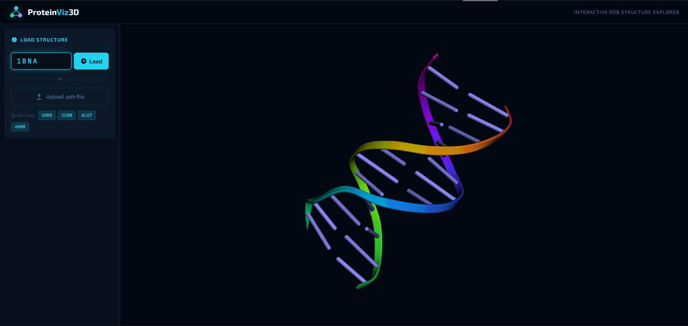
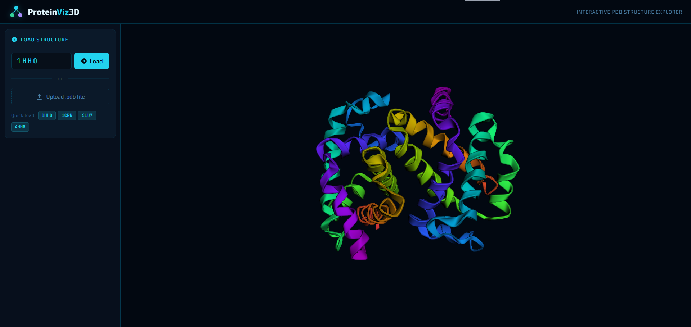
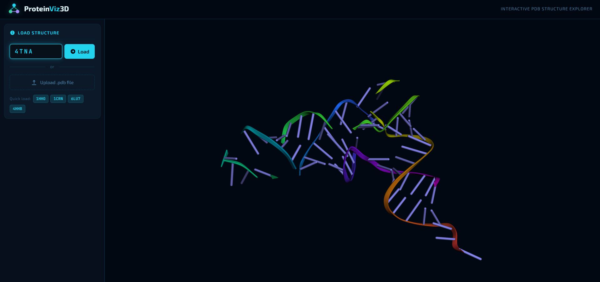

# ProteinViz3D — Interactive PDB Structure Explorer

An interactive 3D protein structure visualizer built with **FastAPI** + **3Dmol.js**.  
Load any protein by PDB ID or upload your own `.pdb` file and explore it in real-time.

## Overview





## Features

- **Fetch by PDB ID** — pulls directly from [RCSB PDB](https://www.rcsb.org/)
- **Upload `.pdb` file** — supports files up to 5 MB
- **Render styles** — Cartoon, Stick, Sphere, Wireframe
- **Color schemes** — Spectrum, Chain, Residue, Element (CPK)
- **Molecular surface** — VDW surface with adjustable opacity
- **Structure metadata** — title, method, resolution, chain count, atom count
- **Drag & drop** — drop `.pdb` files directly onto the viewer

## Quick Start (local)

```bash
git clone https://github.com/<your-username>/ProteinViz3D
cd ProteinViz3D
pip install -r requirements.txt
uvicorn main:app --reload --port 8000
# open http://localhost:8000
```

## Docker

```bash
docker build -t proteinviz3d .
docker run -p 7860:7860 proteinviz3d
# open http://localhost:7860
```

## Tech Stack

| Layer    | Technology                         |
|----------|------------------------------------|
| Backend  | FastAPI + uvicorn                  |
| Frontend | Vanilla HTML/CSS/JS                |
| 3D Render| [3Dmol.js](https://3dmol.org) (WebGL — client-side) |
| Data     | [RCSB PDB REST API](https://data.rcsb.org) |
| Deploy   | HuggingFace Spaces (Docker)        |

## Example PDB IDs to try

| ID    | Description                        |
|-------|------------------------------------|
| 1HHO  | Oxyhemoglobin                      |
| 1CRN  | Crambin (small, loads fast)        |
| 6LU7  | COVID-19 Main Protease             |
| 4HHB  | Human Deoxyhemoglobin              |
| 1BNA  | DNA Double Helix                   |